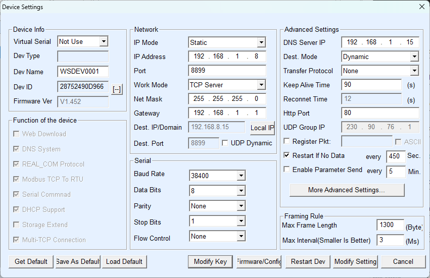

A word of warning: to make use of this script you will have to connect a rs485 connector to your equipment. This means working on mains-voltage equipment so use your head. Always power down equipment before screwing them open and poking around in them. 
Also, all of this software is provided AS-IS with no implied warranty or liability under sections 15, and 16 of the GPL V3. So whatever happens, it is not my fault ;)

# Hewalex 2 Mqtt

Mqtt gateway for hewalex heat pumps and solar pumps.

Solar Pump Hewalex / Geco controllers
G-422-P09
G-422-P09A

Heat Pump (Hewalex solmax)
PCWU 2.5kW
PCWU 3.0kW

Provides read and write access on mqtt topics. A typical use case is integration of hewalex solar pumps and/or heat pumps in Home Automation (HA) software.

This script is based on a domoticz plugin. So if you use domoticz a ready made plugin is available at: https://github.com/mvdklip/Domoticz-Hewalex

## About This Fork

This project is a fork of [Chibald/Hewalex2Mqtt](https://github.com/Chibald/Hewalex2Mqtt) with several improvements:

- **Updated topics** based on the additions from the Domoticz–Hewalex project.  
- **Home Assistant YAML files** added to map MQTT topics to sensors  
  (inspired by [gvamero/Hewalex2Mqtt](https://github.com/gvamero/Hewalex2Mqtt)).  
- **Restructured folder layout** for clearer organization and separation of Home Assistant sensor files.  
- **Improved Docker Compose example** to make it ready to use out of the box.  
- **Configurable refresh rate** added to the configuration file.  
- **Fixed environment variable issues.**  
- **Updated internal checks** that were breaking after introducing an additional MQTT subtopic.


## Hardware Prerequisites

Hewalex devices are equipped with empty RS485 connectors. 
This is basically a serial port. This script uses a 'serial for url' connection. 

You can buy a (cheap) wifi 2 rs485 or ethernet 2 rs485 device wich you attach to the rs485 port you want to interface with. And you need a piece of wire with 4 strands.

2025-11-23 - I use a WaveShare **RS485-to-PoE Ethernet** adapter connected to the Hewalex with the configuration shown below.  
These settings work reliably for me:



### Heat pumps (PCWU) setup

Remove the plastic case and open up the "fuse box". In here you will find a free rs485 connector. Remove it and screw in a 4 strand wire. Connect the wire to the rs485wifi device.
Make sure you connect them correctly. It is wise to measure ac and grnd to be sure!

In the controller, navigate to rs485 settings. Change baud rate to 38400, Actual address to 2 and Logic address to 2.

Setup the rs485-to-wifi device. Make sure baud settings match above settings.
It is probably wise to assign static ip-address. Take note of this.

## devHardId
On your existing controller, verify the hardware and software IDs required for the setup. The integration won’t work if these values are wrong.
In my case, the system only came online after correcting devHardId to 5. For most users this value is typically 2, but don’t assume. Check your own device and set it accordingly.


### Solar pumps (ZPS) setup

Remove G-422 controller from the casing. Connect the RS485 port on the backside of the G-422 controller to the wifi controller. 

## Software Prerequisities

You will need (and if you are reading this probably have) Home Automation software with/and MQTT broker.

Openhab
https://www.openhab.org/

Home Assistant
https://www.home-assistant.io/

But it'll work with any HA system that can process and send MQTT messages.

## Using the script
just run the python script hewalex2mqtt.py, or use the docker image.

### Parameters
All parameters are listed in the .ini file.
Modify them according to your needs when you are not using the pre-made docker image.

When you are using docker, make sure to set the environment variables. Or use the provided docker-compose and modify that according to your setup.


**MQTT**
| Parameter | Value |
| ----------------------- | ----------- |
| MQTT_ip | 192.168.1.2
| MQTT_port | 1883
| MQTT_authentication | True
| MQTT_user | 
| MQTT_pass | 
| MQTT_GatewayDevice_Topic | heatpump/hewalex

**ZPS**
| Parameter | Value |
| ----------------------- | ----------- |
| Device_Zps_Enabled | False
| Device_Zps_Address | IP of the RS485 to Wi-Fi device eg. 192.168.1.7
| Device_Zps_Port | Port of the RS485 to Wi-Fi device eg. 8899
| Device_Zps_MqttTopic | SolarBoiler

**Pcwu**
| Parameter | Value |
| ----------------------- | ----------- |
| Device_Pcwu_Enabled | True
| Device_Pcwu_Address | IP of the RS485 to Wi-Fi device eg. 192.168.1.8
| Device_Pcwu_Port | Port of the RS485 to Wi-Fi device eg. 8899
| Device_Pcwu_MqttTopic | Heatpump

**Hewalex2Mqtt**
| Parameter | Value |
| ----------------------- | ----------- |
| Update_Interval | 30.0

### Home Assistant entities
You can copy the files of [`homeassistant/configs/mqtt`](homeassistant/configs/mqtt/) to you setup. Make sure you import the files like the example shown in [`homeassistant/configuration.yaml`](homeassistant/configuration.yaml)

### Docker
A pre made docker image is available at https://hub.docker.com/r/chibald/hewalex2mqtt. This only works on ARM, so if you need something on x86, please use the dockerfile like below docker-compose example.
Hereby the docker-compose example: [`docker/docker-compose.yml`](docker/docker-compose.yml)
```
services:
  hewalex2mqtt:
    container_name: hewalex2mqtt
    build:
      context: /docker/hewalex2mqtt
      network: host
    restart: unless-stopped
    network_mode: host
    env_file:
      - '.env.hewalex2mqtt'
    volumes:
      - /hewagate:/hewagate
```

## Docker variable file '[`docker/.env.hewalex2mqtt`](docker/.env.hewalex2mqtt)'
```
MQTT_ip=192.168.1.6
MQTT_port=1883
MQTT_authentication=True
MQTT_user=hewalex
MQTT_pass=IDontTellYou
Device_Zps_Enabled=False
Device_Zps_Address=192.168.1.7
Device_Zps_Port=8899
Device_Zps_MqttTopic=SolarBoiler
Device_Pcwu_Enabled=True
Device_Pcwu_Address=192.168.1.8
Device_Pcwu_Port=8899
Device_Pcwu_MqttTopic=heatpump/hewalex
Update_Interval=30
```

## MQTT Topics

There are 2 kinds of topics: state and command. 
Command topics (marked command) allow the sending of commands to topics to control equipment.

### Solar Pump
| Topic | Type | Description |
| ----------------------- | ----------- | ---------------------------
| SolarBoiler/date | date | Date
| SolarBoiler/time | time | Time
| SolarBoiler/T1 | temp | T1 (Collectors temp)
| SolarBoiler/T2 | temp | T2 (Tank bottom temp)
| SolarBoiler/T3 | temp | T3 (Air separator temp)
| SolarBoiler/T4 | temp | T4 (Tank top temp)
| SolarBoiler/T5 | temp | T5 (Boiler outlet temp)
| SolarBoiler/T6 | temp | T6
| SolarBoiler/CollectorPower | word | Collector Power (W)
| SolarBoiler/Consumption | fl10 | Consumption (W)
| SolarBoiler/CollectorActive | bool | Collector Active (True/False)
| SolarBoiler/FlowRate | fl10 | Flow Rate (l/min)
| SolarBoiler/CollectorPumpON | mask | None
| SolarBoiler/CirculationPumpON | mask | None
| SolarBoiler/CollectorPumpSpeed | word | Collector Pump Speed (0-15)
| SolarBoiler/TotalEnergy | fl10 | Total Energy (kWh)
| SolarBoiler/InstallationScheme | word | Installation Scheme (1-19)
| SolarBoiler/DisplayTimeout | word | Display Timeout (1-10 min)
| SolarBoiler/Command/DisplayTimeout | word | Display Timeout (1-10 min)
| SolarBoiler/DisplayBrightness | word | Display Brightness (1-10)
| SolarBoiler/Command/DisplayBrightness | word | Display Brightness (1-10)
| SolarBoiler/AlarmSoundEnabled | bool | Alarm Sound Enabled (True/False)
| SolarBoiler/Command/AlarmSoundEnabled | bool | Alarm Sound Enabled (True/False)
| SolarBoiler/KeySoundEnabled | bool | Key Sound Enabled (True/False)
| SolarBoiler/Command/KeySoundEnabled | bool | Key Sound Enabled (True/False)
| SolarBoiler/DisplayLanguage | word | Display Language (0=PL, 1=EN, 2=DE, 3=FR, 4=PT, 5=ES, 6=NL, 7=IT, 8=CZ, 9=SL, ...)
| SolarBoiler/Command/DisplayLanguage | word | Display Language (0=PL, 1=EN, 2=DE, 3=FR, 4=PT, 5=ES, 6=NL, 7=IT, 8=CZ, 9=SL, ...)
| SolarBoiler/FluidFreezingTemp | temp | Fluid Freezing Temp
| SolarBoiler/Command/FluidFreezingTemp | temp | Fluid Freezing Temp
| SolarBoiler/FlowRateNominal | fl10 | Flow Rate Nominal (l/min)
| SolarBoiler/Command/FlowRateNominal | fl10 | Flow Rate Nominal (l/min)
| SolarBoiler/FlowRateMeasurement | word | Flow Rate Measurement (0=Rotameter, 1=Electronic G916, 2=Electronic)
| SolarBoiler/Command/FlowRateMeasurement | word | Flow Rate Measurement (0=Rotameter, 1=Electronic G916, 2=Electronic)
| SolarBoiler/FlowRateWeight | f100 | Flow Rate Weight (imp/l)
| SolarBoiler/Command/FlowRateWeight | f100 | Flow Rate Weight (imp/l)
| SolarBoiler/HolidayEnabled | bool | Holiday Enabled (True/False)
| SolarBoiler/Command/HolidayEnabled | bool | Holiday Enabled (True/False)
| SolarBoiler/HolidayStartDay | word | Holiday Start Day
| SolarBoiler/Command/HolidayStartDay | word | Holiday Start Day
| SolarBoiler/HolidayStartMonth | word | Holiday Start Month
| SolarBoiler/Command/HolidayStartMonth | word | Holiday Start Month
| SolarBoiler/HolidayStartYear | word | Holiday Start Year
| SolarBoiler/Command/HolidayStartYear | word | Holiday Start Year
| SolarBoiler/HolidayEndDay | word | Holiday End Day
| SolarBoiler/Command/HolidayEndDay | word | Holiday End Day
| SolarBoiler/HolidayEndMonth | word | Holiday End Month
| SolarBoiler/Command/HolidayEndMonth | word | Holiday End Month
| SolarBoiler/HolidayEndYear | word | Holiday End Year
| SolarBoiler/Command/HolidayEndYear | word | Holiday End Year
| SolarBoiler/CollectorType | word | Collector Type (0=Flat, 1=Tube)
| SolarBoiler/Command/CollectorType | word | Collector Type (0=Flat, 1=Tube)
| SolarBoiler/CollectorPumpHysteresis | temp | Collector Pump Hysteresis (Difference between T1 and T2 to turn on collector pump)
| SolarBoiler/Command/CollectorPumpHysteresis | temp | Collector Pump Hysteresis (Difference between T1 and T2 to turn on collector pump)
| SolarBoiler/ExtraPumpHysteresis | temp | Extra Pump Hysteresis (Temp difference to turn on extra pump)
| SolarBoiler/Command/ExtraPumpHysteresis | temp | Extra Pump Hysteresis (Temp difference to turn on extra pump)
| SolarBoiler/CollectorPumpMaxTemp | temp | Collector Pump Max Temp (Maximum T2 temp to turn off collector pump)
| SolarBoiler/Command/CollectorPumpMaxTemp | temp | Collector Pump Max Temp (Maximum T2 temp to turn off collector pump)
| SolarBoiler/BoilerPumpMinTemp | word | Boiler Pump Min Temp (Minimum T5 temp to turn on boiler pump)
| SolarBoiler/Command/BoilerPumpMinTemp | word | Boiler Pump Min Temp (Minimum T5 temp to turn on boiler pump)
| SolarBoiler/HeatSourceMaxTemp | word | Heat Source Max Temp (Maximum T4 temp to turn off heat sources)
| SolarBoiler/Command/HeatSourceMaxTemp | word | Heat Source Max Temp (Maximum T4 temp to turn off heat sources)
| SolarBoiler/BoilerPumpMaxTemp | word | Boiler Pump Max Temp (Maximum T4 temp to turn off boiler pump)
| SolarBoiler/Command/BoilerPumpMaxTemp | word | Boiler Pump Max Temp (Maximum T4 temp to turn off boiler pump)
| SolarBoiler/PumpRegulationEnabled | bool | Pump Regulation Enabled (True/False)
| SolarBoiler/Command/PumpRegulationEnabled | bool | Pump Regulation Enabled (True/False)
| SolarBoiler/HeatSourceMaxCollectorPower | word | Heat Source Max Collector Power (Maximum collector power to turn off heat sources) (100-9900W)
| SolarBoiler/Command/HeatSourceMaxCollectorPower | word | Heat Source Max Collector Power (Maximum collector power to turn off heat sources) (100-9900W)
| SolarBoiler/CollectorOverheatProtEnabled | bool | Collector Overheat Protection Enabled (True/False)
| SolarBoiler/Command/CollectorOverheatProtEnabled | bool | Collector Overheat Protection Enabled (True/False)
| SolarBoiler/CollectorOverheatProtMaxTemp | temp | Collector Overheat Protection Max Temp (Maximum T2 temp for overheat protection)
| SolarBoiler/Command/CollectorOverheatProtMaxTemp | temp | Collector Overheat Protection Max Temp (Maximum T2 temp for overheat protection)
| SolarBoiler/CollectorFreezingProtEnabled | bool | Collector Freezing Protection Enabled (True/False)
| SolarBoiler/Command/CollectorFreezingProtEnabled | bool | Collector Freezing Protection Enabled (True/False)
| SolarBoiler/HeatingPriority | word | Heating Priority
| SolarBoiler/Command/HeatingPriority | word | Heating Priority
| SolarBoiler/LegionellaProtEnabled | bool | Legionella Protection Enabled (True/False)
| SolarBoiler/Command/LegionellaProtEnabled | bool | Legionella Protection Enabled (True/False)
| SolarBoiler/LockBoilerKWithBoilerC | bool | Lock Boiler K With Boiler C (True/False)
| SolarBoiler/Command/LockBoilerKWithBoilerC | bool | Lock Boiler K With Boiler C (True/False)
| SolarBoiler/NightCoolingEnabled | bool | Night Cooling Enabled (True/False)
| SolarBoiler/Command/NightCoolingEnabled | bool | Night Cooling Enabled (True/False)
| SolarBoiler/NightCoolingStartTemp | temp | Night Cooling Start Temp
| SolarBoiler/Command/NightCoolingStartTemp | temp | Night Cooling Start Temp
| SolarBoiler/NightCoolingStopTemp | temp | Night Cooling Stop Temp
| SolarBoiler/Command/NightCoolingStopTemp | temp | Night Cooling Stop Temp
| SolarBoiler/NightCoolingStopTime | word | Night Cooling Stop Time (hr)
| SolarBoiler/Command/NightCoolingStopTime | word | Night Cooling Stop Time (hr)
| SolarBoiler/TimeProgramCM-F | tprg | Time Program C M-F (True/False per hour of the day)
| SolarBoiler/Command/TimeProgramCM-F | tprg | Time Program C M-F (True/False per hour of the day)
| SolarBoiler/TimeProgramCSat | tprg | Time Program C Sat (True/False per hour of the day)
| SolarBoiler/Command/TimeProgramCSat | tprg | Time Program C Sat (True/False per hour of the day)
| SolarBoiler/TimeProgramCSun | tprg | Time Program C Sun (True/False per hour of the day)
| SolarBoiler/Command/TimeProgramCSun | tprg | Time Program C Sun (True/False per hour of the day)
| SolarBoiler/TimeProgramKM-F | tprg | Time Program K M-F (True/False per hour of the day)
| SolarBoiler/Command/TimeProgramKM-F | tprg | Time Program K M-F (True/False per hour of the day)
| SolarBoiler/TimeProgramKSat | tprg | Time Program K Sat (True/False per hour of the day)
| SolarBoiler/Command/TimeProgramKSat | tprg | Time Program K Sat (True/False per hour of the day)
| SolarBoiler/TimeProgramKSun | tprg | Time Program K Sun (True/False per hour of the day)
| SolarBoiler/Command/TimeProgramKSun | tprg | Time Program K Sun (True/False per hour of the day)
| SolarBoiler/CollectorPumpMinRev | word | Collector Pump Min Rev (rev/min)
| SolarBoiler/Command/CollectorPumpMinRev | word | Collector Pump Min Rev (rev/min)
| SolarBoiler/CollectorPumpMaxRev | word | Collector Pump Max Rev (rev/min)
| SolarBoiler/Command/CollectorPumpMaxRev | word | Collector Pump Max Rev (rev/min)
| SolarBoiler/CollectorPumpMinIncTime | word | Collector Pump Min Increase Time (s)
| SolarBoiler/Command/CollectorPumpMinIncTime | word | Collector Pump Min Increase Time (s)
| SolarBoiler/CollectorPumpMinDecTime | word | Collector Pump Min Decrease Time (s)
| SolarBoiler/Command/CollectorPumpMinDecTime | word | Collector Pump Min Decrease Time (s)
| SolarBoiler/CollectorPumpStartupSpeed | word | Collector Pump Startup Speed (1-15)
| SolarBoiler/Command/CollectorPumpStartupSpeed | word | Collector Pump Startup Speed (1-15)
| SolarBoiler/PressureSwitchEnabled | bool | Pressure Switch Enabled (True/False)
| SolarBoiler/Command/PressureSwitchEnabled | bool | Pressure Switch Enabled (True/False)
| SolarBoiler/TankOverheatProtEnabled | bool | Tank Overheat Protection Enabled (True/False)
| SolarBoiler/Command/TankOverheatProtEnabled | bool | Tank Overheat Protection Enabled (True/False)
| SolarBoiler/CirculationPumpEnabled | bool | Circulation Pump Enabled (True/False)
| SolarBoiler/Command/CirculationPumpEnabled | bool | Circulation Pump Enabled (True/False)
| SolarBoiler/CirculationPumpMode | word | Circulation Pump Mode (0=Discontinuous, 1=Continuous)
| SolarBoiler/Command/CirculationPumpMode | word | Circulation Pump Mode (0=Discontinuous, 1=Continuous)
| SolarBoiler/CirculationPumpMinTemp | temp | Circulation Pump Min Temp (Minimum T4 temp to turn on circulation pump)
| SolarBoiler/Command/CirculationPumpMinTemp | temp | Circulation Pump Min Temp (Minimum T4 temp to turn on circulation pump)
| SolarBoiler/CirculationPumpONTime | word | Circulation Pump ON Time (1-59 min)
| SolarBoiler/Command/CirculationPumpONTime | word | Circulation Pump ON Time (1-59 min)
| SolarBoiler/CirculationPumpOFFTime | word | Circulation Pump OFF Time (1-59 min)
| SolarBoiler/Command/CirculationPumpOFFTime | word | Circulation Pump OFF Time (1-59 min)
| SolarBoiler/TotalOperationTime | dwrd | Total Operation Time (min) - lives in config space but is status register
| SolarBoiler/Command/TotalOperationTime | dwrd | Total Operation Time (min) - lives in config space but is status register
| SolarBoiler/Reg320 | word | Unknown register - value changes constantly
| SolarBoiler/Command/Reg320 | word | Unknown register - value changes constantly

### Heat Pump
| Topic | Type | Description |
| ----------------------- | ----------- | ---------------------------
| heatpump/hewalex/date | date | Date
| heatpump/hewalex/time | time | Time
| heatpump/hewalex/T1 | te10 | T1 (Ambient temp)
| heatpump/hewalex/T2 | te10 | T2 (Tank bottom temp)
| heatpump/hewalex/T3 | te10 | T3 (Tank top temp)
| heatpump/hewalex/T4 | te10 | T4 (Solid Fuel Boiler temp)
| heatpump/hewalex/T5 | te10 | T5 (Void)
| heatpump/hewalex/T6 | te10 | T6 (HP water inlet temp)
| heatpump/hewalex/T7 | te10 | T7 (HP water outlet temp)
| heatpump/hewalex/T8 | te10 | T8 (HP evaporator temp)
| heatpump/hewalex/T9 | te10 | T9 (HP before compressor temp)
| heatpump/hewalex/T10 | te10 | T10 (HP after compressor temp)
| heatpump/hewalex/unknown5 | word | Unknown, observed values are 1 (krzysztof1111111111) and 3 (mvdklip)
| heatpump/hewalex/unknown3 | word | Unknown, observed values are 49659, 49663 and 50175; probably a bitmask
| heatpump/hewalex/IsManual | word | Unknown, 2 when controller on, 1 when controller off
| heatpump/hewalex/FanON | mask | None
| heatpump/hewalex/WaterPumpON | mask | None
| heatpump/hewalex/HeatPumpON | mask | None
| heatpump/hewalex/CompressorON | mask | None
| heatpump/hewalex/HeaterEON | mask | None
| heatpump/hewalex/EV1 | word | Expansion Valve 1 - Current opening (step value) of the expansion valve
| heatpump/hewalex/WaitingStatus | word | 0 when available for operation, 2 when disabled through register 304, 64 when low COP, 32 when just stopped and waiting to be restarted
| heatpump/hewalex/WaitingTimer | word | Timer counting down to 0 when just stopped and waiting to be available for operation again
| heatpump/hewalex/unknown7 | word | Unknown, observed value is 0 and is possibly related to alarms
| heatpump/hewalex/unknown8 | word | Unknown, observed value is 0
| heatpump/hewalex/unknown9 | word | Unknown, observed value is 0
| heatpump/hewalex/unknown10 | word | Unknown, observed value is 0
| heatpump/hewalex/InstallationScheme | word | Installation Scheme (1-9)
| heatpump/hewalex/HeatPumpEnabled | bool | Heat Pump Enabled (True/False)
| heatpump/hewalex/Command/HeatPumpEnabled | bool | Heat Pump Enabled (True/False)
| heatpump/hewalex/TapWaterSensor | word | Tap Water Sensor (0=T2, 1=T3, 2=T7)
| heatpump/hewalex/Command/TapWaterSensor | word | Tap Water Sensor (0=T2, 1=T3, 2=T7)
| heatpump/hewalex/TapWaterTemp | te10 | Tap Water Temp (Temperature at sensor above to turn heat pump off)
| heatpump/hewalex/Command/TapWaterTemp | te10 | Tap Water Temp (Temperature at sensor above to turn heat pump off)
| heatpump/hewalex/TapWaterHysteresis | te10 | Tap Water Hysteresis (Difference between sensor and value above to turn heat pump on)
| heatpump/hewalex/Command/TapWaterHysteresis | te10 | Tap Water Hysteresis (Difference between sensor and value above to turn heat pump on)
| heatpump/hewalex/AmbientMinTemp | te10 | Ambient Min Temp (Minimum T1 temperature to turn heat pump on)
| heatpump/hewalex/Command/AmbientMinTemp | te10 | Ambient Min Temp (Minimum T1 temperature to turn heat pump on)
| heatpump/hewalex/TimeProgramHPM-F | tprg | Time Program HP M-F (True/False per hour of the day)
| heatpump/hewalex/Command/TimeProgramHPM-F | tprg | Time Program HP M-F (True/False per hour of the day)
| heatpump/hewalex/TimeProgramHPSat | tprg | Time Program HP Sat (True/False per hour of the day)
| heatpump/hewalex/Command/TimeProgramHPSat | tprg | Time Program HP Sat (True/False per hour of the day)
| heatpump/hewalex/TimeProgramHPSun | tprg | Time Program HP Sun (True/False per hour of the day)
| heatpump/hewalex/Command/TimeProgramHPSun | tprg | Time Program HP Sun (True/False per hour of the day)
| heatpump/hewalex/AntiFreezingEnabled | bool | Anti Freezing Enabled (True/False)
| heatpump/hewalex/Command/AntiFreezingEnabled | bool | Anti Freezing Enabled (True/False)
| heatpump/hewalex/WaterPumpOperationMode | word | Water Pump Operation Mode (0=Continuous, 1=Synchronous)
| heatpump/hewalex/Command/WaterPumpOperationMode | word | Water Pump Operation Mode (0=Continuous, 1=Synchronous)
| heatpump/hewalex/FanOperationMode | word | Fan Operation Mode (0=Max, 1=Min, 2=Day/Night)
| heatpump/hewalex/Command/FanOperationMode | word | Fan Operation Mode (0=Max, 1=Min, 2=Day/Night)
| heatpump/hewalex/DefrostingInterval | word | Defrosting Interval (min)
| heatpump/hewalex/Command/DefrostingInterval | word | Defrosting Interval (min)
| heatpump/hewalex/DefrostingStartTemp | te10 | Defrosting Start Temp
| heatpump/hewalex/Command/DefrostingStartTemp | te10 | Defrosting Start Temp
| heatpump/hewalex/DefrostingStopTemp | te10 | Defrosting Stop Temp
| heatpump/hewalex/Command/DefrostingStopTemp | te10 | Defrosting Stop Temp
| heatpump/hewalex/DefrostingMaxTime | word | Defrosting Max Time (min)
| heatpump/hewalex/Command/DefrostingMaxTime | word | Defrosting Max Time (min)
| heatpump/hewalex/EVOperationMode | word | Expansion Valve Operation Mode (0=Auto, 1=Manual)
| heatpump/hewalex/Command/EVOperationMode | word | Expansion Valve Operation Mode (0=Auto, 1=Manual)
| heatpump/hewalex/EVManualStep | word | Expansion Valve Manual Step (300)
| heatpump/hewalex/Command/EVManualStep | word | Expansion Valve Manual Step (300)
| heatpump/hewalex/EVSuperheatTemp | te10 | Expansion Valve Superheat Temp (1)
| heatpump/hewalex/Command/EVSuperheatTemp | te10 | Expansion Valve Superheat Temp (1)
| heatpump/hewalex/EVInitialStep | word | Expansion Valve Initial Step (200)
| heatpump/hewalex/Command/EVInitialStep | word | Expansion Valve Initial Step (200)
| heatpump/hewalex/EVMinStep | word | Expansion Valve Min Step (120)
| heatpump/hewalex/Command/EVMinStep | word | Expansion Valve Min Step (120)
| heatpump/hewalex/EVDefrostingStep | word | Expansion Valve Defrosting Step (480)
| heatpump/hewalex/Command/EVDefrostingStep | word | Expansion Valve Defrosting Step (480)
| heatpump/hewalex/HeaterEEnabled | bool | Heater E Enabled (True/False)
| heatpump/hewalex/Command/HeaterEEnabled | bool | Heater E Enabled (True/False)
| heatpump/hewalex/HeaterEHPONTemp | te10 | Heater E water temp when HP ON (45.0)
| heatpump/hewalex/Command/HeaterEHPONTemp | te10 | Heater E water temp when HP ON (45.0)
| heatpump/hewalex/HeaterEHPOFFTemp | te10 | Heater E water temp when HP OFF (55.0)
| heatpump/hewalex/Command/HeaterEHPOFFTemp | te10 | Heater E water temp when HP OFF (55.0)
| heatpump/hewalex/HeaterEBlocked | bool | Heater E blocked when HP ON? (True/False)
| heatpump/hewalex/Command/HeaterEBlocked | bool | Heater E blocked when HP ON? (True/False)
| heatpump/hewalex/HeaterETimeProgramM-F | tprg | Heater E Time Program M-F (True/False per hour of the day)
| heatpump/hewalex/Command/HeaterETimeProgramM-F | tprg | Heater E Time Program M-F (True/False per hour of the day)
| heatpump/hewalex/HeaterETimeProgramSat | tprg | Heater E Time Program Sat (True/False per hour of the day)
| heatpump/hewalex/Command/HeaterETimeProgramSat | tprg | Heater E Time Program Sat (True/False per hour of the day)
| heatpump/hewalex/HeaterETimeProgramSun | tprg | Heater E Time Program Sun (True/False per hour of the day)
| heatpump/hewalex/Command/HeaterETimeProgramSun | tprg | Heater E Time Program Sun (True/False per hour of the day)
| heatpump/hewalex/HeaterPEnabled | bool | Heater P Enabled (True/False)
| heatpump/hewalex/Command/HeaterPEnabled | bool | Heater P Enabled (True/False)
| heatpump/hewalex/HeaterPHPONTemp | te10 | Heater P water temp when HP ON (45.0)
| heatpump/hewalex/Command/HeaterPHPONTemp | te10 | Heater P water temp when HP ON (45.0)
| heatpump/hewalex/HeaterPHPOFFTemp | te10 | Heater P water temp when HP OFF (55.0)
| heatpump/hewalex/Command/HeaterPHPOFFTemp | te10 | Heater P water temp when HP OFF (55.0)
| heatpump/hewalex/HeaterPBlocked | bool | Heater P blocked when HP ON? (True/False)
| heatpump/hewalex/Command/HeaterPBlocked | bool | Heater P blocked when HP ON? (True/False)
| heatpump/hewalex/HeaterPTimeProgramM-F | tprg | Heater P Time Program M-F (True/False per hour of the day)
| heatpump/hewalex/Command/HeaterPTimeProgramM-F | tprg | Heater P Time Program M-F (True/False per hour of the day)
| heatpump/hewalex/HeaterPTimeProgramSat | tprg | Heater P Time Program Sat (True/False per hour of the day)
| heatpump/hewalex/Command/HeaterPTimeProgramSat | tprg | Heater P Time Program Sat (True/False per hour of the day)
| heatpump/hewalex/HeaterPTimeProgramSun | tprg | Heater P Time Program Sun (True/False per hour of the day)
| heatpump/hewalex/Command/HeaterPTimeProgramSun | tprg | Heater P Time Program Sun (True/False per hour of the day)
| heatpump/hewalex/CirculationPumpMinTemp | te10 | Circulation Pump Min Temp
| heatpump/hewalex/Command/CirculationPumpMinTemp | te10 | Circulation Pump Min Temp
| heatpump/hewalex/CirculationPumpOperationMode | word | Circulation Pump Operation Mode (0=Continuous, 1=Interrupted)
| heatpump/hewalex/Command/CirculationPumpOperationMode | word | Circulation Pump Operation Mode (0=Continuous, 1=Interrupted)
| heatpump/hewalex/CirculationPumpTimeProgramM-F | tprg | Circulation Pump Time Program M-F (True/False per hour of the day)
| heatpump/hewalex/Command/CirculationPumpTimeProgramM-F | tprg | Circulation Pump Time Program M-F (True/False per hour of the day)
| heatpump/hewalex/CirculationPumpTimeProgramSat | tprg | Circulation Pump Time Program Sat (True/False per hour of the day)
| heatpump/hewalex/Command/CirculationPumpTimeProgramSat | tprg | Circulation Pump Time Program Sat (True/False per hour of the day)
| heatpump/hewalex/CirculationPumpTimeProgramSun | tprg | Circulation Pump Time Program Sun (True/False per hour of the day)
| heatpump/hewalex/Command/CirculationPumpTimeProgramSun | tprg | Circulation Pump Time Program Sun (True/False per hour of the day)
| heatpump/hewalex/BoilerPumpMaxTemp | te10 | Boiler Pump Max Temp (65.0)
| heatpump/hewalex/Command/BoilerPumpMaxTemp | te10 | Boiler Pump Max Temp (65.0)
| heatpump/hewalex/BoilerPumpMinTemp | te10 | Boiler Pump Min Temp (45.0)
| heatpump/hewalex/Command/BoilerPumpMinTemp | te10 | Boiler Pump Min Temp (45.0)
| heatpump/hewalex/BoilerPumpHysteresis | te10 | Boiler Pump Hysteresis (8.0)
| heatpump/hewalex/Command/BoilerPumpHysteresis | te10 | Boiler Pump Hysteresis (8.0)
| heatpump/hewalex/BoilerPumpPriority | bool | Boiler Pump Priority (True/False)
| heatpump/hewalex/Command/BoilerPumpPriority | bool | Boiler Pump Priority (True/False)
| heatpump/hewalex/AntiLegionellaEnabled | bool | Anti-Legionella Enabled (True/False)
| heatpump/hewalex/Command/AntiLegionellaEnabled | bool | Anti-Legionella Enabled (True/False)
| heatpump/hewalex/AntiLegionellaUseHeaterE | bool | Anti-Legionella Use Heater E (True/False)
| heatpump/hewalex/Command/AntiLegionellaUseHeaterE | bool | Anti-Legionella Use Heater E (True/False)
| heatpump/hewalex/AntiLegionellaUseHeaterP | bool | Anti-Legionella Use Heater P (True/False)
| heatpump/hewalex/Command/AntiLegionellaUseHeaterP | bool | Anti-Legionella Use Heater P (True/False)
| heatpump/hewalex/ExtControllerHPOFF | bool | Ext Controller HP OFF (True/False)
| heatpump/hewalex/Command/ExtControllerHPOFF | bool | Ext Controller HP OFF (True/False)
| heatpump/hewalex/ExtControllerHeaterEOFF | bool | Ext Controller Heater E OFF (True/False)
| heatpump/hewalex/Command/ExtControllerHeaterEOFF | bool | Ext Controller Heater E OFF (True/False)
| heatpump/hewalex/ExtControllerPumpFOFF | bool | Ext Controller Pump F OFF (True/False)
| heatpump/hewalex/Command/ExtControllerPumpFOFF | bool | Ext Controller Pump F OFF (True/False)
| heatpump/hewalex/ExtControllerHeaterPOFF | bool | Ext Controller Heater P OFF (True/False)
| heatpump/hewalex/Command/ExtControllerHeaterPOFF | bool | Ext Controller Heater P OFF (True/False)

### Examples
Turn off heat pump
`Heatpump/Command/HeatPumpEnabled False`

Change T2 temperature setting to 52°C
`Heatpump/Command/TapWaterTemp 52`

etc. etc.

## Acknowledgements

Based on
* https://github.com/Chibald/Hewalex2Mqtt
* https://github.com/mvdklip/Domoticz-Hewalex
* https://www.elektroda.pl/rtvforum/topic3499254.html 
* https://github.com/aelias-eu/hewalex-geco-protocol
